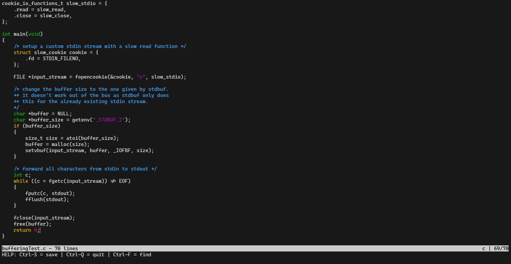

# myTextEditor


textEditor is a simple text editor, designed to be lightweight and easy to use.
It is a personal project, and it is still in development. 
The goal is to provide a minimalistic experience, with a simple interface and a few features.

## Features

- Open and save files
- Syntax highlighting
- Incremental search
- Status bar

## Image




## Installation

To use this program, follow these steps:

1. Clone the repository
```bash
git clone https://github.com/Boshtrat/myTextEditor.git
```

2. Change directory
```bash
cd myTextEditor
```

3. Compile the program
```bash
make
```

4. Run the program
```bash
./myTextEditor
```

## Usage

- **Open a file:** : Pass it as an argument when running the program. *(`./myTextEditor file.txt`)*
- **Save a file:** Press `Ctrl + s` to save the file.
- **Quit:** Press `Ctrl + q` to quit the program.
- **Search:** Press `Ctrl + f` to search for a word in the file. Use arrow keys to navigate through the elements.
- **Syntax highlighting:** The program supports syntax highlighting for C, C++.

## To-do List

- [ ] Change from basic colors to 256-colors palette
- [ ] Add syntax highlighting for more languages
- [ ] Add line numbers
- [ ] Auto indent
- [ ] Mouse support
- [ ] Copy and paste
- [ ] Configuration file
- [ ] Syntax files


Enjoy coding with myTextEditor!